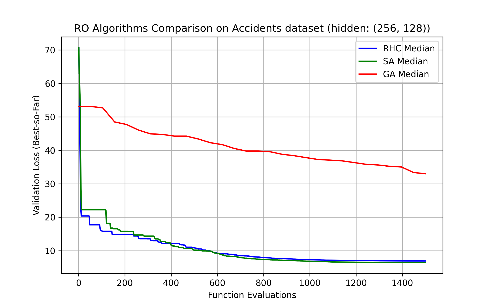
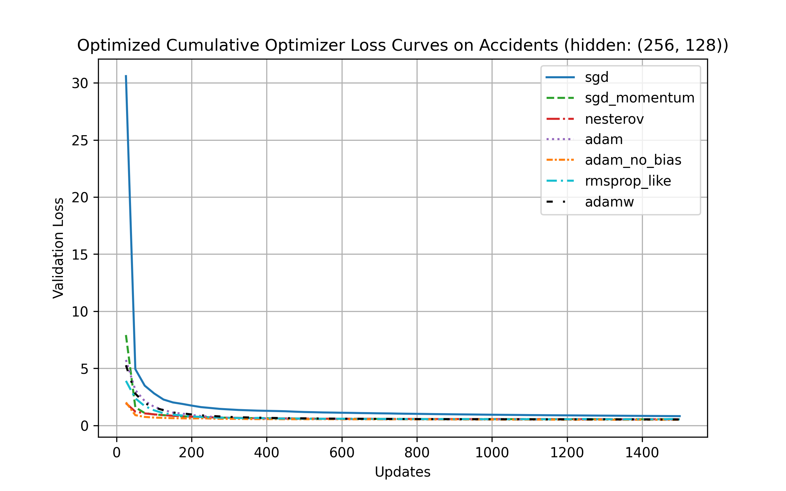
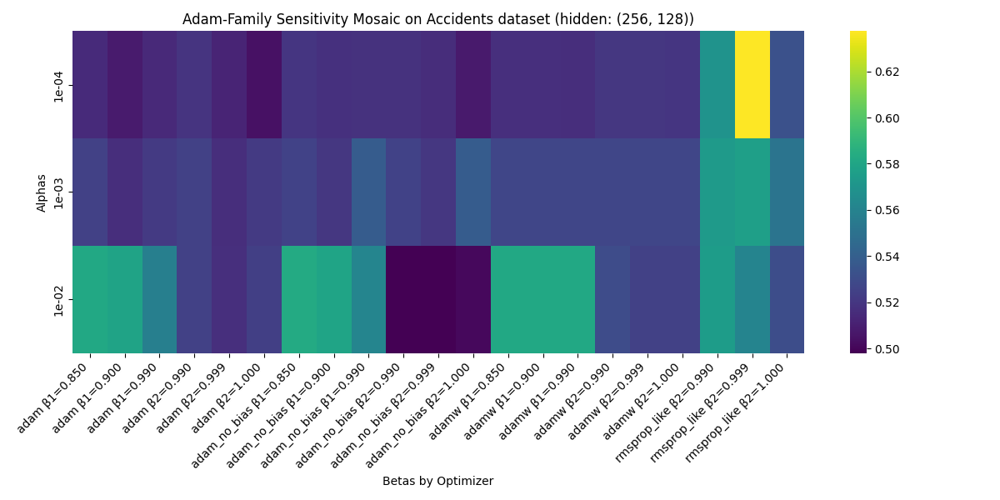
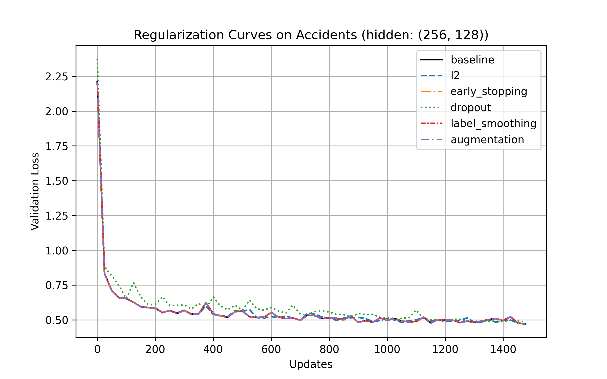
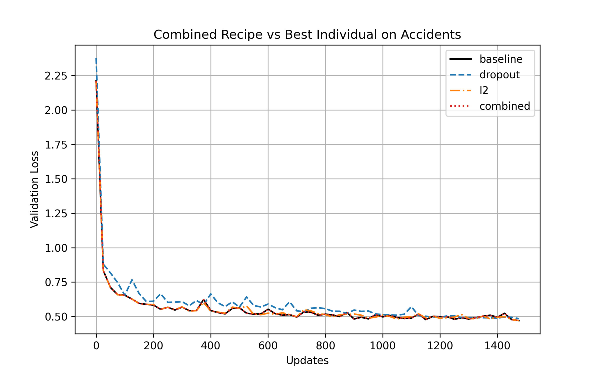

# Optimization and Uncertainty in Learning

## CS 7641 Machine Learning - Fall 2025

**Georgia Institute of Technology**

---

## Project Overview

This project systematically investigates neural network optimization through three complementary experimental approaches:

1. **Part 1: Randomized Optimization** - Compare RHC, SA, and GA algorithms for gradient-free neural network weight optimization
2. **Part 2: Adam Ablations** - Analyze 7 optimizer variants (SGD, momentum, Nesterov, Adam, adam_no_bias, RMSProp-like, AdamW) with hyperparameter sensitivity analysis
3. **Part 3: Targeted Regularization** - Evaluate individual and combined regularization techniques (L2, dropout, early stopping, label smoothing, feature masking)

All experiments use fixed neural network architectures from the Supervised Learning assignment, with consistent evaluation budgets (1,500 function/gradient evaluations) across three random seeds for statistical reliability.

---

## Datasets

### Hotel Booking Demand

-   **Source**: [Kaggle - Hotel Booking Demand](https://www.kaggle.com/datasets/jessemostipak/hotel-booking-demand)
-   **Citation**: António, N. C., Almeida, A., & Nunes, L. (2019). Hotel booking demand datasets. _Data in Brief_, 22, 41-49. doi:10.1016/j.dib.2018.11.126
-   **Initial Size**: ~119,000 samples
-   **After Cleaning**: 87,138 samples
-   **After Preprocessing**: 14 features (categorical encoding applied)
-   **Task**: Binary classification (booking cancellation prediction)
-   **Target**: `is_canceled` (0: 72.7%, 1: 27.3%)
-   **Split**: 60% train (52,282) / 20% val (17,428) / 20% test (17,428)
-   **Usage**: 100% of data used in all experiments

### US Accidents (Since 2016)

-   **Source**: [Kaggle - US Accidents](https://www.kaggle.com/datasets/sobhanmoosavi/us-accidents)
-   **Citation**: Moosavi, S., et al. US Accidents Dataset. CC BY-NC-SA 4.0. Retrieved from Kaggle.
-   **Initial Size**: ~1,000,000 samples
-   **After Cleaning**: 965,860 samples
-   **Subsample**: 772,688 samples (80%)
-   **After Preprocessing**: 28 features
-   **Task**: Regression (accident duration prediction)
-   **Target**: `Duration_Seconds` (log-transformed)
-   **Split**: 60% train (579,516) / 20% val (193,172) / 20% test (193,172)
-   **Usage**: 80% of available data used due to memory constraints

---

## Requirements

### System Requirements

-   **OS**: Linux (tested), Windows (with WSL), or macOS
-   **Python**: 3.8+
-   **Hardware**: GPU recommended (CUDA-compatible for PyTorch), 16GB+ RAM for full datasets

### Installation

```bash
# Clone repository
git clone https://github.com/michaelpeluso/ol.git
cd ol

# Create virtual environment (recommended)
python -m venv venv
source venv/bin/activate  # On Windows: venv\Scripts\activate

# Install dependencies
pip install -r requirements.txt

# Download datasets
# Place hotel_bookings.csv in data/
# Place US_Accidents_March23.csv in data/
```

---

## Project Structure

```
ol/
├── data/                           # Raw datasets
│   ├── hotel_bookings.csv
│   └── US_Accidents_March23.csv
├── src/                            # Source code
│   ├── main.py                     # Main experiment runner
│   ├── experiment.py               # Experiment orchestration class
│   ├── core/                       # Core implementations
│   │   ├── models.py               # MLP architecture with dropout
│   │   ├── optimizers.py           # 7 optimizer variants
│   │   ├── random_optimizers.py    # RHC, SA, GA implementations
│   │   └── training.py             # Training loops and utilities
│   ├── experiments/                # Experiment runners for each part
│   │   ├── random_optimization.py
│   │   ├── adam_ablations.py
│   │   └── targeted_regularization.py
│   └── utils/                      # Utilities
│       ├── data_processing.py      # Data loading and preprocessing
│       ├── logger.py               # Experiment logging
│       └── plotter.py              # Visualization utilities
├── figures/                        # Generated figures and reports
├── logs/                           # Experiment logs
├── cache/                          # Preprocessed data cache
├── requirements.txt                # Python dependencies
└── README.md                       # This file
```

---

## Running Experiments

### Quick Test Run (10% data, 1 seed, 500 evals)

```bash
cd src
python main.py
# Edit main.py: set testing=True
```

### Full Experiments (3 seeds, 1500 evals)

```bash
cd src
python main.py
# Edit main.py: set testing=False
```

**Runtime Estimates** (based on actual execution at 1500 evals):

-   **Total across all networks**: ~5.9 hours
    -   Part 1 (Randomized Optimization): ~46%
    -   Part 2 (Adam Ablations): ~27%
    -   Part 3 (Targeted Regularization): ~27%
-   Hotels nn_2: ~20 minutes
    -   1: 8 min, 2: 6 min, 3: 6 min
-   Hotels nn_4: ~28 minutes
    -   1: 11 min, 2: 8.5 min, 3: 8.5 min
-   Accidents nn_2: ~2.4 hours
    -   1: 71 min, 2: 39 min, 3: 32 min
-   Accidents nn_4: ~2.7 hours
    -   1: 82 min, 2: 45 min, 3: 37 min

## Experimental Methodology

### Budget and Evaluation Types

**Part 1: Randomized Optimization**

-   **Budget**: 1,500 function evaluations
-   **Evaluation type**: Full validation set forward pass (17,428 samples for Hotels, 193,172 for Accidents)
-   **Cost per eval**: ~0.05s (Hotels), ~0.5s (Accidents)
-   **No gradients**: Black-box optimization only

**Parts 2 & 3: Gradient-Based Optimization**

-   **Budget**: 1,500 gradient updates (not function evaluations)
-   **Evaluation type**: Mini-batch forward pass + backward pass + parameter update
-   **Batch size**: 64 (Hotels), 1024 (Accidents)
-   **Cost per update**: ~2.3ms (Hotels)
-   **Total gradient evaluations**: 1,500 updates × 64 batch size = 96,000 gradient computations

### Data Splits

All experiments use consistent splits:

-   **Hotels**: 60% train / 20% val / 20% test (52,282 / 17,428 / 17,428)
-   **Accidents**: 60% train / 20% val / 20% test (579,516 / 193,172 / 193,172)

Validation set used for:

-   Part 1: Objective function (loss to minimize)
-   Parts 2-3: Hyperparameter tuning and early stopping monitoring

### Seeds and Reproducibility

All experiments run with 3 seeds: [42, 4242, 424242] - Torch manual seed set

---

## Configuration

### Main Settings (src/main.py)

**Testing vs Production**:

```python
testing = False              # False for full experiments
subsample = 0.1 if testing else None  # Data fraction
seeds = [42] if testing else [42, 4242, 424242]  # Reproducibility
max_evals = 500 if testing else 1500  # Budget
```

**Hotels Configuration**:

```python
{
    'dataset': "hotels",
    'target': "is_canceled",
    'method': "classification",
    'batch_size': 64,
    'learning_threshold': 0.48,
    'backbone_configs': [
        {'name': 'nn_2', 'hidden_layer_sizes': (256, 128), 'alpha': 1e-05, 'activation': 'tanh'},
        {'name': 'nn_4', 'hidden_layer_sizes': (256, 256, 128, 128), 'alpha': 1e-05, 'activation': 'tanh'}
    ]
}
```

**Accidents Configuration**:

```python
{
    'dataset': "accidents",
    'target': "Duration_Seconds",
    'method': "regression",
    'subsample': 0.8,  # 80% of data
    'batch_size': 1024,
    'learning_threshold': 0.43,
    'backbone_configs': [
        {'name': 'nn_2', 'hidden_layer_sizes': (256, 128), 'alpha': 0.001, 'activation': 'relu'}
    ]
}
```

---

## Architectures

### Hotels

**Hotels nn_2**

-   14 → 256 → 128 → 1
-   Total trainable: 36,994

**Hotels nn_4**

-   14 → 256 → 256 → 128 → 128 → 1
-   Total parameters: 68,234 (exceeds 50K limit)
-   Trained parameters: 32,896

**Hotels Best Parameters**

-   Best tuned config: α=1e-5, hidden=(256,128), activation=tanh, max_iter=15
-   Best tuned performance: Test accuracy=0.757, ROC-AUC=0.809
-   Final train/val losses: 0.447/0.445

### Accidents

**Accidents nn_2**

-   28 → 256 → 128 → 1
-   Total trainable: 40,449

**Accidents nn_4**

-   28 → 256 → 256 → 128 → 128 → 1
-   Total parameters: 68,106 (exceeds 50K limit)
-   Trained parameters: 32,896

**Accidents Best Parameters**

-   Best tuned config: α=0.001, hidden=(512,512), activation=relu, max_iter=5
-   Best tuned performance: MAE=0.488, MSE=0.413, R²=0.285
-   Final train/val losses: 0.402/0.403

---

## Outputs

### Generated Files

```
figures/{dataset}/{architecture}/
├── random_optimization/
│   ├── execution_report.txt            # Complete Part 1 results
│   ├── combined_comparison.png         # RHC vs SA vs GA
│   ├── combined_comparison_log.png     # Log-scale version
│   ├── rhc_stability.png               # RHC across seeds
│   ├── sa_stability.png                # SA convergence (or lack thereof)
│   └── ga_stability.png                # GA population evolution
├── adam_ablations/
│   ├── execution_report.txt            # Complete Part 2 results
│   ├── cumulative_baseline_loss_curves_dotted.png
│   ├── cumulative_optimized_loss_curves_dotted.png
│   ├── combined_sensitivity_mosaic.png # α × β₁ × β₂ heatmaps
│   ├── {optimizer}_alpha_b1_heatmap.png
│   ├── {optimizer}_alpha_b2_heatmap.png
│   ├── {optimizer}_curve_baseline.png
│   └── {optimizer}_curve_optimized.png
├── targeted_regularization/
│   ├── execution_report.txt            # Complete Part 3 results
│   ├── combined_sensitivity_subplots.png
│   ├── combined_recipe_comparison.png
│   ├── cumulative_reg_curves.png       # All regularizers
│   ├── l2_sensitivity.png
│   ├── dropout_sensitivity.png
│   ├── early_stopping_sensitivity.png
│   └── augmentation_sensitivity.png
├── comparison_report.txt               # Cross-part summary
└── comparison_results.json             # Cross-part results JSON

logs/
└── experiment_logs.json                # All experiment metadata
```

---

## Libraries and Code Attribution

### Core Libraries Used

-   **PyTorch 2.0+**: Neural network implementation and training
-   **scikit-learn**: Data preprocessing, metrics, train/test splits
-   **pandas**: Data manipulation and preprocessing
-   **numpy**: Numerical operations
-   **matplotlib/seaborn**: Visualization

### References

See report bibliography for peer-reviewed sources on:

-   Adam optimizer design (Kingma & Ba, 2015)
-   Label smoothing techniques (Szegedy et al., 2016)
-   Randomized optimization for neural networks (Caruana et al., 1996)

---

## AI Use Statement

GitHub Copilot, with Open AI's ChatGPT, Anthropic's Claude, and Xai's Grok were used for:

-   Code generation assistance (boilerplate, data loading utilities)
-   Debugging (syntax errors, tensor shape mismatches)
-   Documentation (docstring formatting, README)
-   Code refactoring (DRY principle, function extraction)

All code was reviewed, verified, and tested. All experimental design, analysis, and conclusions are original work.

---

## Key Results Visualizations

### Part 1: Randomized Optimization (Hotels nn_2, 1500 evals)

**RHC vs SA vs GA Comparison**



_Figure 1: RHC converged consistently to ~0.495 loss, while SA plateaued early and GA showed high variance._

### Part 2: Adam Ablations (Hotels nn_2, 1500 evals)

**Optimizer Convergence Curves (Optimized Hyperparameters)**



_Figure 2: Adam-family optimizers (adam, adam_no_bias, rmsprop_like, adamw) converged nearly identically. Learning rate 10× more important than optimizer choice._

**Hyperparameter Sensitivity (adam_no_bias)**



_Figure 3: Learning rate (α) dominates performance; β₁ and β₂ show minimal impact when α is well-tuned._

### Part 3: Targeted Regularization (Hotels nn_2, 1500 evals)

**Regularization Techniques Comparison**



_Figure 4: Baseline (no regularization) achieved best performance. Dropout hurt performance; L2/early stopping/augmentation had zero effect._

**Combined Recipe vs Individual Techniques**



_Figure 5: Combined regularization recipe identical to baseline - multiple regularizers interfere rather than complement._

---

## Experimental Results Summary

This section provides a brief overview of key findings from all three parts. For detailed analysis, tables, and figures, see the full report and `resources/analyses/complete_ol_analysis.md`.

### Performance Overview (Hotels nn_2)

**Baseline to Final**: 7.6% improvement (0.5061 → 0.4678 test loss)

| Stage                      | Best Method           | Test Loss     | Key Insight                                                 |
| -------------------------- | --------------------- | ------------- | ----------------------------------------------------------- |
| **Part 1: RO**             | RHC                   | 0.495 ± 0.007 | RHC converged reliably; SA failed (plateaued at 17% budget) |
| **Part 2: Optimizers**     | adam_no_bias (α=1e-4) | 0.499 ± 0.000 | Learning rate 10× more important than optimizer choice      |
| **Part 3: Regularization** | Baseline (no reg)     | 0.468 ± 0.001 | Small networks don't benefit from regularization            |

### Main Findings

1. **Randomized Optimization**: RHC (exponential decay + restarts) significantly outperformed SA and GA for gradient-free optimization
2. **Optimizer Analysis**: Adam-family optimizers (adam, adam_no_bias, rmsprop_like, adamw) performed nearly identically; momentum critical for SGD
3. **Regularization**: For this 37K parameter network, baseline configuration optimal - dropout hurt performance, L2/early stopping/augmentation had zero effect
4. **Unexpected Results**:
    - RHC initially beat gradient-based adam due to poor learning rate
    - Label smoothing created validation/test paradox (expected behavior)
    - Combined regularization recipe identical to baseline (techniques interfere)

See `figures/hotels/nn_2/comparison_report.txt` for complete cross-part analysis.

---

## Author

**Michael Peluso**  
Georgia Institute of Technology  
CS 7641: Machine Learning  
Fall 2025

---

## License

This project is for academic purposes only as part of CS 7641 coursework.  
Datasets are subject to their original licenses (see citations above).
